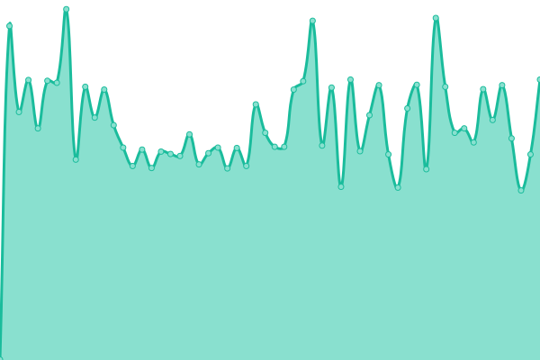
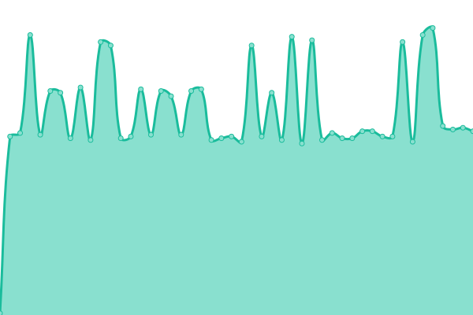

# [📈 Live Status](https://status.deep-hybrid-datacloud.eu): <!--live status--> **🟧 Partial outage**

This repository contains the open-source uptime monitor and status page for [DEEP-Hybrid-DataCloud](https://deep-hybrid-datacloud.eu), powered by [Upptime](https://github.com/upptime/upptime).

With [Upptime](https://upptime.js.org), you can get your own unlimited and free uptime monitor and status page, powered entirely by a GitHub repository. We use [Issues](https://github.com/deephdc/status/issues) as incident reports, [Actions](https://github.com/deephdc/status/actions) as uptime monitors, and [Pages](https://status.deep-hybrid-datacloud.eu) for the status page.

<!--start: status pages-->
<!-- This summary is generated by Upptime (https://github.com/upptime/upptime) -->
<!-- Do not edit this manually, your changes will be overwritten -->
<!-- prettier-ignore -->
| URL | Status | History | Response Time | Uptime |
| --- | ------ | ------- | ------------- | ------ |
|  [DEEP web page](https://deep-hybrid-datacloud.eu/) | 🟩 Up | [deep-web-page.yml](https://github.com/deephdc/status/commits/HEAD/history/deep-web-page.yml) | 

 1472ms
     
 | 

<a href="https://status.deep-hybrid-datacloud.eu/history/deep-web-page">100.00%</a>
    

|  [DEEP Training Dashboard](https://train.deep-hybrid-datacloud.eu/) | 🟩 Up | [deep-training-dashboard.yml](https://github.com/deephdc/status/commits/HEAD/history/deep-training-dashboard.yml) | 

 704ms
     
 | 

<a href="https://status.deep-hybrid-datacloud.eu/history/deep-training-dashboard">100.00%</a>
    

|  [DEEPaaS](https://deepaas.deep-hybrid-datacloud.eu/api/v1/web/deepaas/deep-oc/list.json) | 🟥 Down | [dee-paa-s.yml](https://github.com/deephdc/status/commits/HEAD/history/dee-paa-s.yml) | 

 726ms
     
 | 

<a href="https://status.deep-hybrid-datacloud.eu/history/dee-paa-s">100.00%</a>
    

|  [DEEP Marketplace](https://marketplace.deep-hybrid-datacloud.eu/) | 🟩 Up | [deep-marketplace.yml](https://github.com/deephdc/status/commits/HEAD/history/deep-marketplace.yml) | 

 446ms
     
 | 

<a href="https://status.deep-hybrid-datacloud.eu/history/deep-marketplace">100.00%</a>
    

|  [Identity and access Management (IAM)](https://iam.deep-hybrid-datacloud.eu/) | 🟩 Up | [identity-and-access-management-iam.yml](https://github.com/deephdc/status/commits/HEAD/history/identity-and-access-management-iam.yml) | 

 3722ms
     
 | 

<a href="https://status.deep-hybrid-datacloud.eu/history/identity-and-access-management-iam">100.00%</a>
    

|  [NextCloud](https://nc.deep-hybrid-datacloud.eu/) | 🟩 Up | [next-cloud.yml](https://github.com/deephdc/status/commits/HEAD/history/next-cloud.yml) | 

 830ms
     
 | 

<a href="https://status.deep-hybrid-datacloud.eu/history/next-cloud">100.00%</a>
    

|  [PaaS dashboard](https://deep-paas.cloud.ba.infn.it/) | 🟩 Up | [paa-s-dashboard.yml](https://github.com/deephdc/status/commits/HEAD/history/paa-s-dashboard.yml) | 

 2075ms
     
 | 

<a href="https://status.deep-hybrid-datacloud.eu/history/paa-s-dashboard">0.00%</a>
    

|  [PaaS Orchestrator](https://deep-paas.cloud.ba.infn.it/orchestrator) | 🟩 Up | [paa-s-orchestrator.yml](https://github.com/deephdc/status/commits/HEAD/history/paa-s-orchestrator.yml) | 

 281ms
     
 | 

<a href="https://status.deep-hybrid-datacloud.eu/history/paa-s-orchestrator">100.00%</a>
    

|  [Configuration Management DB (CMDB)](https://deep-paas.cloud.ba.infn.it/cmdb) | 🟩 Up | [configuration-management-db-cmdb.yml](https://github.com/deephdc/status/commits/HEAD/history/configuration-management-db-cmdb.yml) | 

 311ms
     
 | 

<a href="https://status.deep-hybrid-datacloud.eu/history/configuration-management-db-cmdb">100.00%</a>
    

|  [Infrastructure Manager (IM)](https://deep-paas.cloud.ba.infn.it/im/version) | 🟩 Up | [infrastructure-manager-im.yml](https://github.com/deephdc/status/commits/HEAD/history/infrastructure-manager-im.yml) | 

 146ms
     
 | 

<a href="https://status.deep-hybrid-datacloud.eu/history/infrastructure-manager-im">100.00%</a>
    

|  [SLA Manager (SLAM)](https://deep-slam.cloud.ba.infn.it:8443/rest/slam) | 🟩 Up | [sla-manager-slam.yml](https://github.com/deephdc/status/commits/HEAD/history/sla-manager-slam.yml) | 

 1736ms
     
 | 

<a href="https://status.deep-hybrid-datacloud.eu/history/sla-manager-slam">100.00%</a>
    

|  [CI/CD Infrastructure](https://jenkins.indigo-datacloud.eu/) | 🟩 Up | [ci-cd-infrastructure.yml](https://github.com/deephdc/status/commits/HEAD/history/ci-cd-infrastructure.yml) | 

 912ms
     
 | 

<a href="https://status.deep-hybrid-datacloud.eu/history/ci-cd-infrastructure">42.49%</a>
    

|  [Provider IFCA-LCG2   eu.indigo-datacloud.mesos](https://mesos.cloud.ifca.es/mesos) | 🟩 Up | [provider-ifca-lcg-2-eu-indigo-datacloud-mesos.yml](https://github.com/deephdc/status/commits/HEAD/history/provider-ifca-lcg-2-eu-indigo-datacloud-mesos.yml) | 

 2556ms
     
 | 

<a href="https://status.deep-hybrid-datacloud.eu/history/provider-ifca-lcg-2-eu-indigo-datacloud-mesos">100.00%</a>
    

|  [Provider IFCA-LCG2   eu.indigo-datacloud.marathon](https://mesos.cloud.ifca.es/marathon) | 🟩 Up | [provider-ifca-lcg-2-eu-indigo-datacloud-marathon.yml](https://github.com/deephdc/status/commits/HEAD/history/provider-ifca-lcg-2-eu-indigo-datacloud-marathon.yml) | 

 565ms
     
 | 

<a href="https://status.deep-hybrid-datacloud.eu/history/provider-ifca-lcg-2-eu-indigo-datacloud-marathon">100.00%</a>
    

|  [Provider IFCA-LCG2   org.openstack.nova](https://api.cloud.ifca.es:5000/v3) | 🟩 Up | [provider-ifca-lcg-2-org-openstack-nova.yml](https://github.com/deephdc/status/commits/HEAD/history/provider-ifca-lcg-2-org-openstack-nova.yml) | 

 525ms
     
 | 

<a href="https://status.deep-hybrid-datacloud.eu/history/provider-ifca-lcg-2-org-openstack-nova">100.00%</a>
    

|  [Provider IISAS-Bratislava    eu.indigo-datacloud.chronos](https://mesos.ui.sav.sk/chronos) | 🟩 Up | [provider-iisas-bratislava-eu-indigo-datacloud-chronos.yml](https://github.com/deephdc/status/commits/HEAD/history/provider-iisas-bratislava-eu-indigo-datacloud-chronos.yml) | 

 621ms
     
 | 

<a href="https://status.deep-hybrid-datacloud.eu/history/provider-iisas-bratislava-eu-indigo-datacloud-chronos">100.00%</a>
    

|  [Provider IISAS-Bratislava    eu.indigo-datacloud.marathon](https://mesos.ui.sav.sk/marathon) | 🟩 Up | [provider-iisas-bratislava-eu-indigo-datacloud-marathon.yml](https://github.com/deephdc/status/commits/HEAD/history/provider-iisas-bratislava-eu-indigo-datacloud-marathon.yml) | 

 126ms
     
 | 

<a href="https://status.deep-hybrid-datacloud.eu/history/provider-iisas-bratislava-eu-indigo-datacloud-marathon">100.00%</a>
    

|  [Provider QCG     eu.deep.qcg](https://qcg-deep.apps.paas-dev.psnc.pl/api) | 🟩 Up | [provider-qcg-eu-deep-qcg.yml](https://github.com/deephdc/status/commits/HEAD/history/provider-qcg-eu-deep-qcg.yml) | 

 1781ms
     
 | 

<a href="https://status.deep-hybrid-datacloud.eu/history/provider-qcg-eu-deep-qcg">100.00%</a>
    

|  [Provider RECAS-BARI  org.openstack.nova](https://cloud.recas.ba.infn.it:5000/v3) | 🟩 Up | [provider-recas-bari-org-openstack-nova.yml](https://github.com/deephdc/status/commits/HEAD/history/provider-recas-bari-org-openstack-nova.yml) | 

 1693ms
     
 | 

<a href="https://status.deep-hybrid-datacloud.eu/history/provider-recas-bari-org-openstack-nova">100.00%</a>
    

<!--end: status pages-->

[**Visit our status website →**](https://status.deep-hybrid-datacloud.eu)

## 📄 License

- Powered by: [Upptime](https://github.com/upptime/upptime)
- Code: [MIT](./LICENSE) © [DEEP-Hybrid-DataCloud](https://deep-hybrid-datacloud.eu)
- Data in the `./history` directory: [Open Database License](https://opendatacommons.org/licenses/odbl/1-0/)
